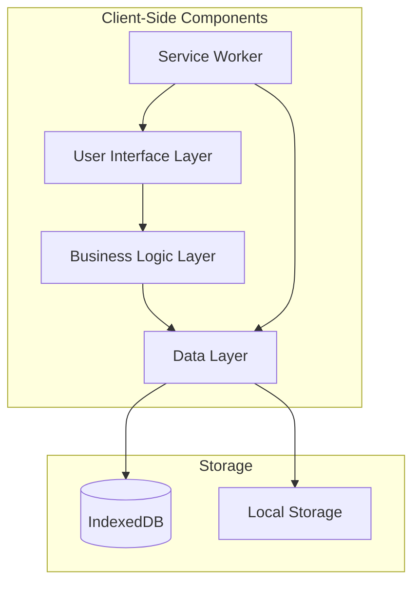

# Design Document

## Overview

TriageAid - A Medical Triage PWA is designed as an offline-first Progressive Web Application that enables medical professionals to quickly assess and prioritize patients using established triage protocols. The application follows a simple, secure, and efficient architecture optimized for low-power devices and unreliable network conditions.

### Key Design Principles
- **Offline-First**: All core functionality works without internet connectivity
- **Security by Design**: Client-side encryption and anonymous data handling
- **Performance Optimized**: Lightweight architecture for older devices
- **User-Centric**: Simple, intuitive interface for medical professionals
- **Accessibility**: Multi-language support and clear visual indicators

## Architecture

### High-Level Architecture



### PWA Architecture Components

1. **Application Shell**: Cached HTML, CSS, and JavaScript providing the basic UI structure
2. **Service Worker**: Handles offline functionality, caching, and background sync
3. **Web App Manifest**: Defines app metadata for installation and native-like experience
4. **IndexedDB Storage**: Primary data storage for patient records and app state using Dexie.js
5. **Encryption Layer**: Client-side encryption using Web Crypto API

### Technology Stack

- **Frontend Framework**: Preact with TypeScript for lightweight, reactive UI
- **Build Tool**: Vite for fast development and optimized production builds
- **Styling**: Tailwind CSS for consistent, responsive design
- **PWA Tools**: Workbox for service worker management and caching strategies
- **Database**: Dexie.js wrapper for IndexedDB operations
- **Encryption**: Web Crypto API for client-side data encryption
- **Internationalization**: Custom i18n solution for English/Arabic support

## Components and Interfaces

### Core Components

#### 1. Patient Intake Component
```typescript
interface PatientIntakeProps {
  onSubmit: (patientData: PatientData) => void;
  onCancel: () => void;
  existingPatient?: PatientData;
}

interface PatientData {
  id: string;
  ageGroup: 'child' | 'adult';
  vitals: {
    pulse: number | null;
    breathing: 'normal' | 'labored' | 'absent';
    circulation: 'normal' | 'bleeding' | 'shock';
    consciousness: 'alert' | 'verbal' | 'pain' | 'unresponsive';
  };
  injuries: string[];
  timestamp: Date;
  priority?: TriagePriority;
  status: 'active' | 'treated' | 'transferred';
}
```

#### 2. Triage Engine Component
```typescript
interface TriageEngine {
  assessPatient(patientData: PatientData): TriagePriority;
  getTriageRules(): TriageRule[];
}

interface TriagePriority {
  level: 'red' | 'yellow' | 'green' | 'black';
  description: string;
  urgency: number;
}

interface TriageRule {
  condition: (patient: PatientData) => boolean;
  priority: TriagePriority;
  reasoning: string;
}
```

#### 3. Patient Dashboard Component
```typescript
interface PatientDashboardProps {
  patients: PatientData[];
  onPatientSelect: (patientId: string) => void;
  onPatientUpdate: (patientId: string, updates: Partial<PatientData>) => void;
  sortBy: 'priority' | 'timestamp';
  filterBy: TriagePriority['level'] | 'all';
}
```

#### 4. Data Service Layer
```typescript
interface DataService {
  // Patient CRUD operations
  createPatient(patientData: Omit<PatientData, 'id'>): Promise<string>;
  getPatient(id: string): Promise<PatientData | null>;
  updatePatient(id: string, updates: Partial<PatientData>): Promise<void>;
  getAllPatients(): Promise<PatientData[]>;
  deletePatient(id: string): Promise<void>;
  
  // Encryption operations
  encryptData(data: any): Promise<string>;
  decryptData(encryptedData: string): Promise<any>;
}
```

### Service Worker Interface

```typescript
interface ServiceWorkerEvents {
  'install': () => void;
  'activate': () => void;
  'fetch': (event: FetchEvent) => void;
  'sync': (event: SyncEvent) => void;
}

interface CacheStrategy {
  name: string;
  pattern: RegExp;
  strategy: 'CacheFirst' | 'NetworkFirst' | 'StaleWhileRevalidate';
}
```

## Data Models

### Patient Data Model

```typescript
interface PatientData {
  // Unique identifier (UUID v4)
  id: string;
  
  // Basic demographics (minimal for privacy)
  ageGroup: 'child' | 'adult';
  
  // Vital signs for triage assessment
  vitals: {
    pulse: number | null; // beats per minute
    breathing: 'normal' | 'labored' | 'absent';
    circulation: 'normal' | 'bleeding' | 'shock';
    consciousness: 'alert' | 'verbal' | 'pain' | 'unresponsive'; // AVPU scale
  };
  
  // Injury assessment
  injuries: string[]; // Array of injury descriptions
  
  // System metadata
  timestamp: Date; // When patient was first assessed
  lastUpdated: Date; // When record was last modified
  priority: TriagePriority; // Calculated triage priority
  status: 'active' | 'treated' | 'transferred' | 'discharged';
  
  // Optional notes (encrypted)
  notes?: string;
}
```

### Triage Priority Model

```typescript
interface TriagePriority {
  level: 'red' | 'yellow' | 'green' | 'black';
  description: string;
  urgency: number; // 1-4 for sorting (1 = highest priority)
  color: string; // Hex color code for UI display
  icon: string; // Icon identifier for visual representation
}

const TRIAGE_PRIORITIES: Record<string, TriagePriority> = {
  red: {
    level: 'red',
    description: 'Immediate - Life threatening',
    urgency: 1,
    color: '#DC2626',
    icon: 'emergency'
  },
  yellow: {
    level: 'yellow',
    description: 'Urgent - Serious injuries',
    urgency: 2,
    color: '#D97706',
    icon: 'warning'
  },
  green: {
    level: 'green',
    description: 'Minor - Can wait',
    urgency: 3,
    color: '#059669',
    icon: 'check'
  },
  black: {
    level: 'black',
    description: 'Deceased/Expectant',
    urgency: 4,
    color: '#374151',
    icon: 'cross'
  }
};
```

### Application State Model

```typescript
interface AppState {
  // Current view/route
  currentView: 'dashboard' | 'intake' | 'patient-detail';
  
  // Selected patient for editing
  selectedPatientId: string | null;
  
  // UI preferences
  language: 'en' | 'ar';
  theme: 'light' | 'dark';
  
  // Dashboard filters
  dashboardFilter: {
    priority: TriagePriority['level'] | 'all';
    status: PatientData['status'] | 'all';
    sortBy: 'priority' | 'timestamp';
    sortOrder: 'asc' | 'desc';
  };
  
  // App metadata
  isOnline: boolean;
  lastSync: Date | null;
  version: string;
}
```

## START Triage Algorithm Implementation

### Triage Decision Tree

```typescript
class StartTriageEngine implements TriageEngine {
  assessPatient(patient: PatientData): TriagePriority {
    // Step 1: Walking wounded
    if (this.canWalkAndFollowCommands(patient)) {
      return TRIAGE_PRIORITIES.green; // Minor
    }
    
    // Step 2: Breathing assessment
    if (patient.vitals.breathing === 'absent') {
      // In real triage, attempt airway positioning
      // For app purposes, assume airway management attempted
      if (patient.vitals.airwayCleared && patient.vitals.breathing === 'absent') {
        return TRIAGE_PRIORITIES.black; // Deceased
      }
      // If breathing returns after airway management
      return TRIAGE_PRIORITIES.red;
    }
    
    if (patient.vitals.respiratoryRate !== null && patient.vitals.respiratoryRate > 30) {
      return TRIAGE_PRIORITIES.red; // Immediate
    }
    
    // Step 3: Perfusion assessment
    if (this.hasPoorPerfusion(patient)) {
      return TRIAGE_PRIORITIES.red; // Immediate
    }
    
    // Step 4: Mental status
    if (!this.canFollowSimpleCommands(patient)) {
      return TRIAGE_PRIORITIES.red; // Immediate
    }
    
    // If reaches here = stable vitals, conscious, good perfusion
    return TRIAGE_PRIORITIES.yellow; // Delayed
  }
  
  private canWalkAndFollowCommands(patient: PatientData): boolean {
    return patient.mobility === 'ambulatory' && 
           patient.vitals.consciousness === 'alert';
  }
  
  private hasPoorPerfusion(patient: PatientData): boolean {
    return patient.vitals.capillaryRefill > 2 || 
           patient.vitals.radialPulse === 'absent';
  }
  
  private canFollowSimpleCommands(patient: PatientData): boolean {
    return patient.vitals.consciousness === 'alert' ||
           patient.vitals.consciousness === 'responds_to_verbal';
  }
}
```

## Error Handling

### Error Categories

1. **Data Persistence Errors**
   - IndexedDB quota exceeded
   - Storage corruption
   - Encryption/decryption failures

2. **Input Validation Errors**
   - Invalid vital sign values
   - Missing required fields
   - Data type mismatches

3. **Application Errors**
   - Service worker registration failures
   - Cache corruption
   - State management errors

### Error Handling Strategy

```typescript
interface ErrorHandler {
  handleError(error: AppError): void;
  logError(error: AppError): void;
  showUserError(message: string, severity: 'info' | 'warning' | 'error'): void;
}

interface AppError {
  type: 'data' | 'validation' | 'system' | 'network';
  code: string;
  message: string;
  details?: any;
  timestamp: Date;
  recoverable: boolean;
}

class ErrorHandlingService implements ErrorHandler {
  handleError(error: AppError): void {
    this.logError(error);
    
    if (error.recoverable) {
      this.showUserError(error.message, 'warning');
      this.attemptRecovery(error);
    } else {
      this.showUserError('A critical error occurred. Please restart the app.', 'error');
    }
  }
  
  private attemptRecovery(error: AppError): void {
    switch (error.type) {
      case 'data':
        this.recoverDataError(error);
        break;
      case 'validation':
        this.recoverValidationError(error);
        break;
      default:
        // Log and continue
        break;
    }
  }
}
```

## Testing Strategy

### Testing Approach

Given the hackathon timeline and requirements, testing will focus on:

1. **Manual Testing**: Comprehensive manual testing of core user flows
2. **Browser Testing**: Cross-browser compatibility testing
3. **Device Testing**: Testing on various mobile devices and screen sizes
4. **Offline Testing**: Verification of offline functionality
5. **Performance Testing**: Basic performance validation on low-end devices

### Critical Test Scenarios

1. **Patient Intake Flow**
   - Complete patient assessment with all vital signs
   - Triage priority calculation accuracy
   - Data persistence after app restart

2. **Offline Functionality**
   - App functionality without network connection
   - Data synchronization when network returns
   - Service worker caching behavior

3. **Data Security**
   - Patient data encryption/decryption
   - Anonymous ID generation
   - No PII storage verification

4. **Multi-language Support**
   - UI translation completeness
   - Language preference persistence
   - RTL layout for Arabic

5. **Performance**
   - App loading time on slow devices
   - Triage calculation speed
   - Memory usage optimization

### Testing Tools

- **Manual Testing**: Browser developer tools, device simulators
- **Performance**: Lighthouse audits, Chrome DevTools Performance tab
- **Accessibility**: axe-core browser extension
- **PWA Validation**: PWA Builder validation tools

## Security Considerations

### Data Protection

1. **Client-Side Encryption**: All patient data encrypted before storage
2. **Anonymous Identifiers**: UUID-based patient IDs with no PII
3. **Local Storage Only**: No data transmission to external servers
4. **Secure Deletion**: Proper data cleanup when patients are removed

### Privacy by Design

1. **Minimal Data Collection**: Only essential triage information
2. **Data Retention**: Configurable data retention policies
3. **Access Control**: App-level access without user authentication
4. **Audit Trail**: Basic logging of data access patterns

### Implementation Security

```typescript
interface SecurityService {
  generatePatientId(): string;
  encryptPatientData(data: PatientData): Promise<string>;
  decryptPatientData(encryptedData: string): Promise<PatientData>;
  validateInput(input: any, schema: ValidationSchema): ValidationResult;
}

class WebCryptoSecurityService implements SecurityService {
  private readonly algorithm = 'AES-GCM';
  private readonly keyLength = 256;
  
  async generateEncryptionKey(): Promise<CryptoKey> {
    return await crypto.subtle.generateKey(
      { name: this.algorithm, length: this.keyLength },
      false,
      ['encrypt', 'decrypt']
    );
  }
  
  generatePatientId(): string {
    return crypto.randomUUID();
  }
  
  async encryptPatientData(data: PatientData): Promise<string> {
    const key = await this.getOrCreateKey();
    const encoder = new TextEncoder();
    const dataBuffer = encoder.encode(JSON.stringify(data));
    
    const iv = crypto.getRandomValues(new Uint8Array(12));
    const encryptedData = await crypto.subtle.encrypt(
      { name: this.algorithm, iv },
      key,
      dataBuffer
    );
    
    return this.arrayBufferToBase64(encryptedData);
  }
}
```

This design provides a comprehensive foundation for building the medical triage PWA with all the specified requirements while maintaining security, performance, and usability for medical professionals in challenging environments.