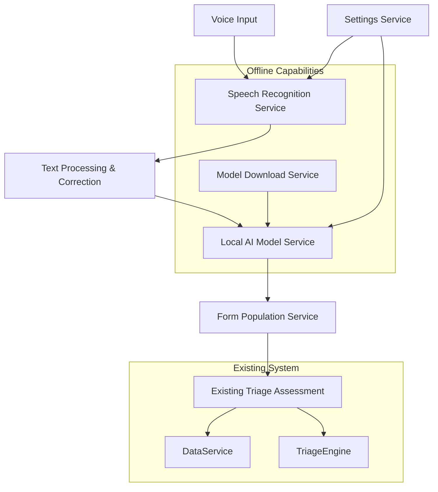
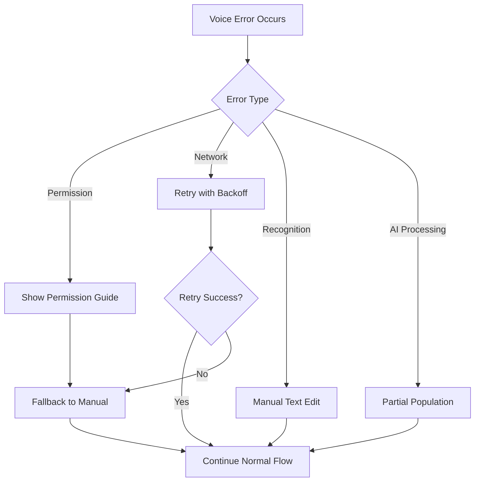

# Design Document

## Overview

The Voice AI Triage feature enhances TriageAid by adding voice-to-text functionality with local AI model integration. This feature enables medical personnel to perform faster triage assessments through voice input, automatic transcription, and AI-powered form population while maintaining complete offline functionality and data privacy.

The system consists of three main components: voice recognition using Web Speech API, local AI model integration using WebLLM/Transformers.js, and seamless integration with the existing PatientIntakeForm component.

## Architecture

### High-Level Architecture



### Service Layer Integration

The voice AI functionality integrates with the existing service architecture:

- **VoiceRecognitionService**: Handles speech-to-text conversion using Web Speech API
- **LocalAIService**: Manages local AI model operations using WebLLM or Transformers.js
- **ModelDownloadService**: Handles downloading and caching AI models
- **VoiceSettingsService**: Manages voice AI configuration and preferences
- **FormPopulationService**: Bridges AI output to form field population

## Components and Interfaces

### 1. VoiceRecognitionService

```typescript
interface VoiceRecognitionService {
  // Core functionality
  startListening(): Promise<void>;
  stopListening(): void;
  isListening(): boolean;
  
  // Configuration
  setLanguage(language: 'en' | 'ar'): void;
  setSensitivity(level: number): void;
  
  // Events
  onTranscription(callback: (text: string, isFinal: boolean) => void): void;
  onError(callback: (error: VoiceError) => void): void;
  onStatusChange(callback: (status: VoiceStatus) => void): void;
}

interface VoiceError {
  type: 'permission' | 'network' | 'recognition' | 'unsupported';
  message: string;
  recoverable: boolean;
}

interface VoiceStatus {
  isSupported: boolean;
  hasPermission: boolean;
  isListening: boolean;
  language: string;
}
```

### 2. LocalAIService

```typescript
interface LocalAIService {
  // Model management
  isModelAvailable(): boolean;
  downloadModel(onProgress?: (progress: number) => void): Promise<void>;
  getModelInfo(): ModelInfo | null;
  
  // AI processing
  processTriageText(text: string): Promise<TriageAnalysis>;
  
  // Configuration
  setModelPath(path: string): void;
  clearModel(): Promise<void>;
}

interface ModelInfo {
  name: string;
  size: number;
  version: string;
  downloadDate: Date;
  language: 'en' | 'ar';
}

interface TriageAnalysis {
  confidence: number;
  extractedFields: {
    ageGroup?: 'child' | 'adult';
    breathing?: 'normal' | 'labored' | 'absent';
    circulation?: 'normal' | 'bleeding' | 'shock';
    consciousness?: 'alert' | 'verbal' | 'pain' | 'unresponsive';
    mobility?: 'ambulatory' | 'non-ambulatory';
    pulse?: number;
    respiratoryRate?: number;
    capillaryRefill?: number;
    radialPulse?: 'present' | 'absent';
    injuries?: string[];
    notes?: string;
  };
  reasoning: string;
  suggestions: string[];
}
```

### 3. VoiceTriageComponent

```typescript
interface VoiceTriageComponentProps {
  onTextGenerated: (text: string) => void;
  onFieldsPopulated: (fields: TriageAnalysis) => void;
  isEnabled: boolean;
  language: 'en' | 'ar';
}

interface VoiceTriageState {
  isListening: boolean;
  transcribedText: string;
  isProcessing: boolean;
  aiAnalysis: TriageAnalysis | null;
  error: VoiceError | null;
  modelStatus: 'not-downloaded' | 'downloading' | 'ready' | 'error';
}
```

### 4. Enhanced PatientIntakeForm Integration

The existing PatientIntakeForm will be enhanced with:

```typescript
interface EnhancedPatientIntakeFormProps extends PatientIntakeFormProps {
  voiceEnabled?: boolean;
  onVoiceToggle?: (enabled: boolean) => void;
}

interface VoiceFormState {
  voiceMode: boolean;
  transcriptionText: string;
  aiSuggestions: TriageAnalysis | null;
  autoPopulatedFields: Set<string>;
}
```

## Data Models

### Voice Configuration

```typescript
interface VoiceSettings {
  enabled: boolean;
  language: 'en' | 'ar';
  autoPopulate: boolean;
  sensitivity: number; // 0-1
  modelPreference: 'small' | 'medium' | 'large';
  downloadOnWifi: boolean;
}
```

### Model Storage

```typescript
interface StoredModel {
  id: string;
  name: string;
  version: string;
  language: 'en' | 'ar';
  size: number;
  downloadDate: Date;
  modelData: ArrayBuffer;
  metadata: {
    accuracy: number;
    speed: number;
    memoryUsage: number;
  };
}
```

## Error Handling

### Error Types and Recovery Strategies

1. **Permission Errors**
   - Graceful degradation to manual input
   - Clear user guidance for enabling microphone permissions
   - Fallback to text input with helpful messaging

2. **Model Download Errors**
   - Retry mechanism with exponential backoff
   - Network status detection
   - Partial download resumption
   - Clear progress indication and error messaging

3. **Recognition Errors**
   - Automatic retry for transient errors
   - Manual retry option for users
   - Clear indication of recognition quality
   - Fallback to manual text editing

4. **AI Processing Errors**
   - Graceful fallback to manual form filling
   - Partial field population when possible
   - Clear indication of AI confidence levels
   - User override capabilities

### Error Recovery Flow



## Implementation Approach

### Phase 1: Core Voice Recognition
- Implement VoiceRecognitionService using Web Speech API
- Create basic VoiceTriageComponent with transcription display
- Add voice toggle to PatientIntakeForm
- Implement error handling and fallback mechanisms

### Phase 2: Local AI Integration
- Research and select optimal local AI model (WebLLM vs Transformers.js)
- Implement LocalAIService with model management
- Create ModelDownloadService with progress tracking
- Implement basic field extraction and population

### Phase 3: Enhanced User Experience
- Add text editing capabilities for transcription correction
- Implement confidence indicators and user review workflow
- Add voice settings and configuration options
- Optimize performance and memory usage

### Phase 4: Documentation and Polish
- Update README and feature documentation
- Add user guides and help content
- Implement analytics for feature usage
- Final bug fixes

## Technology Choices

### Speech Recognition
- **Web Speech API**: Native browser support, good accuracy, works offline in some browsers
- **Fallback**: Manual text input with clear guidance

### Local AI Models
- **Primary Choice: WebLLM**: 
  - Excellent performance for text analysis
  - Good model selection (Llama, Phi, etc.)
  - WebAssembly-based for better performance
  - Active development and community

- **Alternative: Transformers.js**:
  - Hugging Face ecosystem
  - Good model variety
  - Easier integration
  - Smaller models available

### Model Selection Criteria
- **Small Model (~100MB)**: Fast inference, lower accuracy
- **Medium Model (~500MB)**: Balanced performance

### Storage Strategy
- **IndexedDB**: For model storage and caching
- **Service Worker**: For background model management
- **Compression**: GZIP compression for model files

## Security and Privacy

### Data Privacy
- All voice processing happens locally
- No voice data transmitted to external servers
- Transcribed text stored temporarily in memory only
- AI model runs entirely offline

### Model Security
- Model integrity verification using checksums
- Secure download over HTTPS
- Local storage encryption for sensitive model data
- Regular model updates with security patches

### User Consent
- Clear consent flow for microphone access
- Transparent data usage explanation
- Easy opt-out mechanisms
- Privacy-first design principles

## Performance Considerations

### Memory Management
- Lazy loading of AI models
- Memory cleanup after processing
- Efficient model caching strategies
- Background processing optimization

### Battery Optimization
- Efficient speech recognition algorithms
- Model inference optimization
- Background processing limits
- User-configurable performance modes

### Network Efficiency
- Resumable downloads
- Compression and delta updates
- Offline-first architecture

## Internationalization

### Current Implementation
- English language support with Web Speech API
- English-trained AI models for field extraction
- UI text localization using existing i18n system

### Future Arabic Support
- Arabic speech recognition (when browser support improves)
- Arabic-trained AI models
- RTL layout considerations for voice UI
- Arabic text processing and validation

### Implementation Strategy
- Language detection and switching
- Model selection based on language
- Fallback mechanisms for unsupported languages
- Clear messaging about language limitations